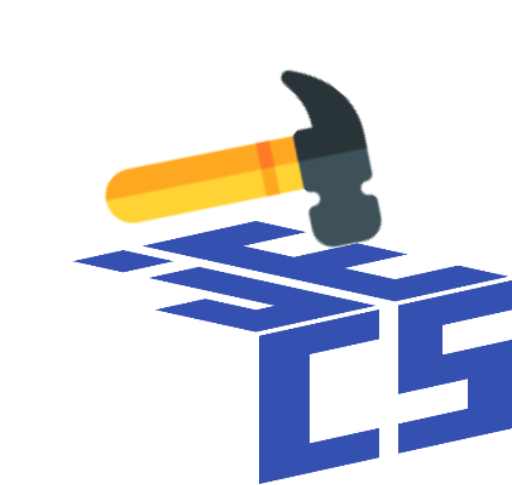

<p align="center">
    
</p>

[](https://github.com/mark-marks/hammer/actions/workflows/ci.yml)
[](https://github.com/mark-marks/hammer/actions/workflows/release.yml)
[](https://github.com/Mark-Marks/hammer/blob/main/LICENSE)
<a href="https://wally.run/package/mark-marks/hammer"></a>
<a href="https://pesde.dev/packages/marked/hammer"></a>

A set of utilities for [Jecs](https://github.com/ukendio/jecs)
<br/>

</div>

## ⛓️‍💥 Installation

Hammer is available on pesde @ `marked/hammer` and Wally @ `mark-marks/hammer`.

## 📄 Changelog

To view per-version changes, see [the changelog](/CHANGELOG.md).

## 🔨 Usage

All utilities that require a Jecs world to function are exposed via a constructor pattern.\
For instance, to build a `ref`:
```luau
local ref = hammer.ref(world)
```
This is the easiest solution for passing a world that doesn't sacrifice readability internally and externally or bind the developer to a Jecs version that hammer is currently using.

A recommended approach to initialize the utilities which need a world is to place them in a shared ECS `std` folder, which's utilities you can use later:
```luau
-- std/ref.luau
local world = require("./world")
return hammer.ref(world)
```
```luau
-- my_system.luau
local ref = require("@std/ref")
...
```
Initializing them in every file on require shouldn't be a problem, though, as all of them are cached by world (spare for command buffers!).

### Collect

[Collect](/lib/utilities/collect.luau) collects all arguments fired through the given signal into a queue, and exposes an iterator to flush it.\
Its purpose is to interface with signals in ECS code, which ideally should run every frame in a loop.

For instance, take Roblox's RemoteEvents:
```luau
local pings = hammer.collect(events.ping.OnServerEvent)
local function system()
    for _, player, ping in pings do
        events.ping:FireClient(player, "pong!")
    end
end
```

Collect works with any signal which:
- Is a function which sets a callback
- Exposes a `:connect` or `:Connect` method

Collect also returns a cleanup function to stop listening to the event.\
If the signal doesn't return an object with a `:disconnect`, `:Disconnect`, `:destroy`, `:Destroy` method or a cleanup function, it's simply a no-op.

### Command Buffer

A [command buffer](/lib/utilities/command_buffer.luau) lets you buffer world commands in order to prevent iterator invalidation.\
Iterator invalidation refers to an iterator (e.g. `world:query(Component)`) becoming unusable due to changes in the underlying data.

To prevent this, command buffers can be used to delay world operations to the end of the current frame:
```luau
local command_buffer = hammer.command_buffer(world)

while true do
    step_systems()
    command_buffer.flush()
end

-- Inside a system:
command_buffer.add(entity, component) -- This runs after all of the systems run; no data changes while things are running
```

### Ref

A [ref](/lib/utilities/ref.luau) allows for storing and getting entities via some form of reference.\
This is particularly useful for situations where you reconcile entities into your world from a foreign place, e.g. from across a networking boundary, or need an easy way to get an entity from an object, e.g. a player.
```luau
local ref = hammer.ref(world)

for id in net.new_entities.iter() do
    local entity = ref(`foreign-{id}`) -- A new entity that can be tracked via a foreign id
end
```

Refs by default create a new entity if the given value doesn't reference any stored one. In case you want to see if a reference exists, you can find one:
```luau
local entity[: Entity?] = ref.find(`my-key`)
```

Refs can also be deleted:
```luau
local entity = ref(`my-key`)
ref.delete(`my-key`) -- `entity` still persists in the world, but `my-key` doesn't refer to it anymore.
```

Refs are automatically cached by world. `ref(world)` will have the same underlying references as `ref(world)`.\
In case you need an unique reference store, you can omit the cache via `ref(world, true)`.

### Observers

[Observers](/lib/utilities/observers.luau) allow for observing entities of a matching query.

Observers can be seen as a reactive counterpart to systems, similar to hooks, albeit allowing for more flexibility, as they operate on queries in place of singular components.
```luau
hammer.observer(world:query(Position, Velocity), function(entity)
    --- Ran whenever an entity matching the query has any of its terms changed.
    --- In this instance, the callback would be ran whenever an entity which has a position and velocity has either of the two modified.
end)
```

Monitors are a special kind of observer, which run whenever an entity starts or stops matching a query.
```luau
local monitor = hammer.monitor(world:query(Position, Velocity))
monitor.added(function(entity)
    --- Ran whenever an entity starts matching the query.
    --- In this case, the entity began to have both a position and velocity.
end)
monitor.removed(function(entity)
    --- Ran whenever an entity stops matching the query.
    --- In this case, the entity stopped having either a position or a velocity.
end)
```

Both kinds of observers return tables which contain a disconnect function serving as a way to clean the observer up.
```luau
local observer = hammer.observer(...)
observer.disconnect()
```

Remember to be careful! Observers aren't without their costs.

The [Flecs article on observers](https://www.flecs.dev/flecs/md_docs_2ObserversManual.html) contains more useful information about them, albeit the Jecs and Flecs implementations and interfaces don't fully match.

Observers are a direct copy of [the addon in the Jecs repo](https://github.com/Ukendio/jecs/blob/main/addons/ob.luau), licensed under MIT.

### Interval

[Intervals](/lib/utilities/interval.luau) allow for throttling systems to only run every `n` seconds. This can, for instance, be useful to throttle networking events, or physics.

```luau
local replication_throttle = hammer.interval(1 / 10) -- Run every 100ms
local function replication()
    if not replication_throttle() then
        return
    end
    -- Only runs every 100ms

    for player, packet in replicator:collect_packets() do
        ...
    end
end
```

### IsA

[IsA](/lib/utilities/is_a.luau) allows for transitive inheritance relationships. In essence, this means that you can express an entity as being equivalent to another, without the reverse needing to be true.

A nice use of this is for entity prefabs, allowing you to have a "template" entity you can create copies of via adding the relationship.
```luau
local IsA = hammer.is_a(world)

local Spaceship = world:component()
world:set(Spaceship, Health, 250)
world:set(Spaceship, Shields, 50)
world:set(Spaceship, Damage, 35)
world:set(Spaceship, Position, vector.create(100, 20, 100))
world:set(Spaceship, Velocity, vector.create(10, 0, 4))

local my_spaceship = world:entity()
world:add(my_spaceship, pair(IsA, Spaceship))
-- `my_spaceship` now has all of the components of `Spaceship`, alongside the component `Spaceship` itself. Be careful while iterating spaceships though - to not include the prefab, make sure to add `pair(IsA, Spaceship)` to your query!
-- You can override the components by operating on the world like usual:
world:set(spaceship, Health, 230)
```

A further read can be found at the [Flecs relationships article](https://www.flecs.dev/flecs/md_docs_2Relationships.html#the-isa-relationship), and specifically the section about IsA relationships.

The implementation is based on [the IsA gist](https://gist.github.com/Ukendio/0d839428324bd10b7e4a16568cb856c8) created by the Jecs author, albeit further optimized to skip creating intermediate archetypes.

## ⚖️ License

This project is licensed under the terms of the MIT license. To further explore the terms, read [here](/LICENSE).
